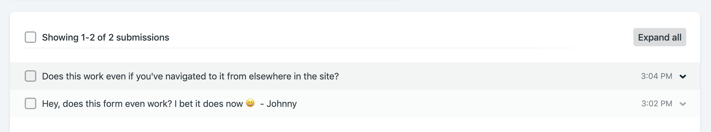

I always sing the praises of [Netlify], which you'd only mistake as a paid promotion if you haven't heard me sing.

But, seriously, just for their easy flow to configure, build & deploy straight from github sources, as well as review the results in a neat dashboard, they'd be getting the thumbs up from me, alongside services like [surge]. What pushes them to the top, is that you get deploy previews on PRs and split testing, all in a generous free tier 😍

So they've been my go-to "let's upload this frontend to the cloud" tool for a while, and they've been releasing quite a few "value add" features since their launch in 2015 in hopes of retaining that honour; and maybe to gain users other than myself, or to get a better distribution into their paid tiers.

One new feature I haven't had a chance to play with was [Forms]... And now that I've got a fresh new blog with a couple call-outs to get in touch with feedback, advice and ideas, but no direct way to be emailed, I've got my excuse to try it out!

[netlify]: https://www.netlify.com/ 'Build, deploy, and manage modern web projects'
[surge]: https://surge.sh 'Front end devs deploy'
[forms]: https://www.netlify.com/docs/form-handling/ 'their built-in form handling'

## Netlify Forms

Contact forms are a big enough hassle that they weren't part of my blog's MVP. Scoping adding one in my mind, I'd be using something like [Mandrill] or [Sendgrid], either as a frontend-only solution, or I'd be migrating the blog to [App Engine]: the frontend / default service would be what currently gets deployed to Netlify, and some backend service would be receiving the data of my contact form, validating it, and emailing it to me using one of the above third parties.

But, what if there was an easier solution? Netlify claims all you need is one extra attribute added to a regular form!

```tsx{2}
export const Form = () => (
  <form name="contact" method="POST" data-netlify="true">
    ...
  </form>
)
```

After your build step but before actually uploading your code, Netlify looks for the `data-netlify` attribute in any forms in your html, and performs its magic to set things up to receive data for them. It uses the given `name` attribute of the forms to categorize the submissions, and the labels of the input fields to group the values.

It **almost** "just works", but before we get to the big gotcha when used in a Gatsby site, let's talk about form validation!

[mandrill]: https://mandrill.com/ 'Transactional email for Mailchimp'
[sendgrid]: https://sendgrid.com/ 'Send emails with confidence'
[app engine]: https://cloud.google.com/appengine/ 'Build highly scalable applications on a fully managed serverless platform'

## Form Validation

With Javascript everywhere and frontend development easier than ever, there is the temptation to re-skin everything and personally handhold the user each step of the way. I'd be interested to find out the percentage of online forms that are still semantically correct: made out of form elements, input fields and submit buttons, versus "forms" that function the same but are made out of over-styled divs and spans, and are actually using Javascript to send their values to a backend.

I might be assuming a misconception that's not actually that popular, but I think it bears highlighting, just in case it is: Using React does not mean you should be controlling every component, or be remaking native elements into something you can style more easily. You should be leveraging native elements and functionality as much as possible!

If the output of our code is semantically correct html, modern browsers will validate and handle the UX of submitting a form for us: highlighting the fields that still need filling, reminding the user what an email looks like, giving them numeric keyboards to fill in number inputs... all the while looking like a native experience across browsers and platforms; cause it will literally be the native experience!

But what if the user goes out of their way to circumvent the client-side validation? Well, that's why you should always have validation on the backend as well! In our case, they're free to send **the hax** to Netlify's servers. I'm sure they've had to handle SQL injections before, and if they do drop a table somewhere, I wouldn't really be affected.

Netlify is also doing some basic spam filtering out of the box, and you may spend an extra five minutes for some additional anti-bot protection!

## Fighting Spam

A cool technique that's easy to use and fun to visualize is adding a "honeypot" input field in your form, that's styled to be invisible to humans. The theory is that rudimentary spam bots would just be parsing html and filling out everything they can before submitting, without considering visibility. Your frontend would pretend the bot submission was a success, but your backend would use the evidence of somebody sticking a value in an invisible field to discard the form data as spam. The bot would be caught by the honeypot!

To add that type of protection to your netlify form, all you need is a hidden input in the form, and to specify its name in the `data-netlify-honeypot` attribute:

```tsx{6,10}
export const Form = () => (
  <form
    name="contact"
    method="POST"
    data-netlify="true"
    data-netlify-honeypot="bot-field"
  >
    <Hidden>
      <label>
        Don’t fill this out if you're human: <input name="bot-field" />
      </label>
    </Hidden>
    ...
  </form>
)
```

This tells Netlify to configure the `contact` form to discard any submissions that have any value for `bot-field`!

There is a similarly straightforward way to add [reCaptcha] protection to your form, but I'd rather not raise the effort required for a real user to send me a message; at least not before I find myself drowning in spam.

So it all looks nice and simple, what's the **catch**?

[recaptcha]: https://developers.google.com/recaptcha/ 'Easy to add, advanced security'

## Gotcha

It looks like Netlify's pre-upload step is supposed to add a hidden `form-name` input field to your form, which the docs cover in a quick paragraph on... AJAX requests? We are definitely **not** doing something Asynchronous here, and only **technically** using Javascript: Gatsby should have things compiled to vanilla HTML by the point Netlify tries to upload the build artifacts.

In any case, that input field is kinda like a reverse honeypot: its non-existence leads to a submission being quietly discarded! And, unfortunately, I've found Netlify's magic does not quite work when it comes to adding it in, so you need to hard-code it in yourself. Which, of course, is **not** hard, just something that needed to be clearly highlighted in the documentation! It's the likely reason Netlify Forms won't **just work** for you if you're using Gatsby, and you'll need to spend a bit of time debugging; Maybe that's what brought you to this post!

So, it's worth repeating: When you're using Netlify Forms with Gatsby, you need to have an input field for `form-name` with a value equal to your form's name inside the relevant form.

What a sentence. But it's true, and it works!


Last step for me was getting the user to a custom "success" page after they've submitted and, again, it was as easy as using a vanilla html form attribute: `action`. Simply use it to specify the relative url you want to redirect to, and you're golden; remembering to use Gatsby's in-app url prefixer helper method... just in case you'll be deploying somewhere other than the root of a domain.

You could take things even further by triggering a webhook on form submission, or Netlify's own [Functions], actually AWS Lambdas, and create something like this [crazy comments engine]... however, **sheer ingenuity** is not really needed for our humble use-case, so my final code looks like this:

```tsx
type Props = {
  className?: string
}

export const Form = ({ className }: Props) => (
  <Container
    className={className}
    name="contact"
    method="POST"
    data-netlify-honeypot="bot-field"
    data-netlify="true"
    action={withPrefix('/thanks/')}
  >
    <Hidden>
      <label>
        Don't fill this out if you're human: <input name="bot-field" />
      </label>
    </Hidden>
    <Hidden>
      <label>
        Netlify needs this to match up the form data:{' '}
        <input name="form-name" value="contact" readOnly />
      </label>
    </Hidden>
    <InputContainer>
      <label htmlFor="email">Your email</label>
      <input
        id="email"
        type="email"
        name="email"
        placeholder="maily@mcmailface.com"
        required
      />
    </InputContainer>
    <InputContainer>
      <label htmlFor="message">Your message</label>
      <textarea
        id="message"
        name="message"
        placeholder="Hey, I love your blog and..."
        rows={5}
        required
      />
    </InputContainer>
    <ButtonContainer>
      <Button type="submit">Submit</Button>
    </ButtonContainer>
  </Container>
)
```

As always, you're welcome to check out the full code from the blog's [github repo].

[functions]: https://www.netlify.com/docs/functions/#event-triggered-functions 'Amazon Web Services strike again'
[crazy comments engine]: https://www.netlify.com/docs/functions/#event-triggered-functions 'crazy... like a fox!'
[github repo]: https://github.com/jmagrippis/today-i 'One day this will have a committer other than myself'

## Viewing submissions

As minimal as the additions for Netlify were, you can get a form that sends results into the ether with **0 extra code**; in order for the above to matter, you need to actually be able to see the results. So, can you?

Of course! As soon as Netlify deploys a site that is trying to use the Forms feature as discussed, it will populate the Forms Dashboard for it, where you can see all submissions. Additionally, you may also set up email or slack notifications for new submissions, on a per-form basis.



## Parting thoughts

As advertised, Netlify Forms is indeed an easy way to add forms to your app, without messing with another third-party provider, or needing to scaffold a backend. It's close to the metal in how it's implemented, with minimal "vendor-specific magic". My only wish would be for the `form-name` part of the magic to be more explicit in the documentation, as I'm sure it will catch more people out.

So, well played Netlify! Another strong showing, which tempts me to try your wrapper on Lambdas next... Should I? Use the contact button below to let me know your thoughts 😄
