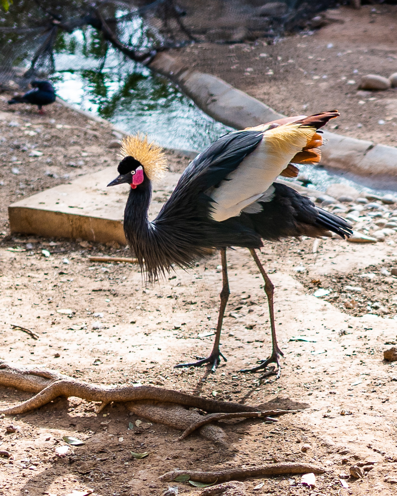

Of all the surf joints in all the towns in all the world, I walked into one in Morocco. Not [Casablanca], **Taghazout**, landing in **Agadir** and spending a couple days there as well.

I arrived just before sunset, and saw the biggest sun I had ever seen. It was **huge**, presumably due to the closeness to the equator, as well as the slight fog which persisted throughout my vacation and diffused the sun's crown quite gloriously.

The quirkiest thing of the trip was how prevalent middle-men were, for the smallest things! I'd try to establish transport from the one city to the next and get in the taxi, only to be driven a few meters down the road and asked to enter a different taxi.

Similarly, I'd try to buy eggs from the grocery store, watch a fraction of my dirham be given to an errand boy who would eventually return with some eggs for me. I like to imagine a chain of errand boys handing over increasingly miniscule sums of money, until they get a dozen eggs from a farmer outside Marrakesh.

I am not sure if this qualifies as another example, but I took a picture of a cute dog on the beach, and was promptly approached by its owner, who asked for money. Whether he counts as a middle-man or not, that's the best segue I can muster for the photos section 😄

[casablanca]: https://en.wikiquote.org/wiki/Casablanca_(film) 'I came to Casablanca for the waters.'

## Photos

I have pulled out my favourites for this blog post, as well as submitted a couple to [Unsplash]. If you want to see all the ones I've deemed worthy, please do find them in my [travel album]!

I love the colour palette that now appears when I close my eyes and think of Morocco: cyan and copper!

I did find Morocco a reasonably picturesque place, Taghazout more so. Camels are extremely uncommon for me, so they were a prime subject to shoot; the beaches and seaside, not so much, I am used to better 😛

[travel album]: https://lightroom.adobe.com/shares/04539815076c4c00a82cbafa9e957a79 'Like, comment and subscribe!'
[unsplash]: https://unsplash.com/@jmagrippis 'I love using it, so I am giving back!'

## Zoos

Speaking of the camels, the sad thing about them is that it does file they're being exploited, turned into obvious tourist bait. The one below looks well taken care of at least, healthy and cleaned, but there quite a few that presumably had a harder life.

Similar thoughts arise whenever I visit a zoo. I never plan out a visit, but when one happens to be in my path I'll fancy a look, which is what happened with the one in Agadir.

The animals are always amazing, but are they suffering? Are they provided a new lease on life? Is it a depressed life because they can't roam the fields as their nature dictates? I'd say it depends from zoo to zoo and animal to animal! This one, I do think there were too many birds in too small cages...

Oh well. This bird did look beautiful:

## Surf / Swim

Ever since I first tried surfing, in Brazil back in October last year, I've been dying for another crack at it! Morocco was supposedly a decent surf spot, and Taghazout the cream of the crop for the period, and that's how I ended up on a slightly less touristic place than your usual Moroccan destinations!

There was, however, **zero** surfing. No waves! I couldn't believe the Atlantic ocean was flatter than the lake in Hyde Park, but there it was. The sea itself didn't look too inviting, maybe I'm spoiled from growing up **in** some pristine Mediterranean waters, but it looked a bit dull, and smelled a bit rank 😝

I am still thankful for Taghazout though! It did have some very appreciated surf vibes, extremely chill placer for a chill vacation.

## The Blog

So what did I do with the time I had allocated to surfing? I created [this blog]! 🤓

Feel free to read more about **why** on that post, but here I'll just say coding by the beach, feeling the sea-breeze, listening to the waves, was **amazing**. Also, managing to build an app with no internet access and going for lunch to deploy it with the free wifi, feels pretty boss 😄

[this blog]: /a-blog-with-gatsby 'You are in it!'

## The Food

The food was tasty and plentiful. Tajines are supposedly legendary in Morocco, they were ok but I didn't find myself writing home about them. The fish and seafood in Taghazout were the highlight for me, along with the generous portion sizes on every dish.

We did do some home cooking, I do have a plan to make scrambled eggs all around the world after all. I'd classify the "fresh" ingredients as "decent". With the dry heat and the amount of insects, I imagine it's kinda hard to keep a decent tomato, but we managed to scavenge some acceptable tomatoes, peppers, onions and avocados. Would have appreciated a nice bakery even more though!

## Would I go again

No! I am genuinely happy I went, however, I do think Agadir and Taghazout are the type of place where once is enough. They're great when they have the "I'm seeing something new" bonus, but with so many new places to explore, or places to revisit that just felt better, I won't be visiting that side of Morocco again 😄

I would go elsewhere in Morocco though! I'd love to land in Marrakesh and get out into the desert, ride a camel for a while, take in the sand dunes, get some incredible shots of the night sky! Then spend a day or two in the Blue City! I'll definitely have that itinerary in my head as I plan out future vacations.

